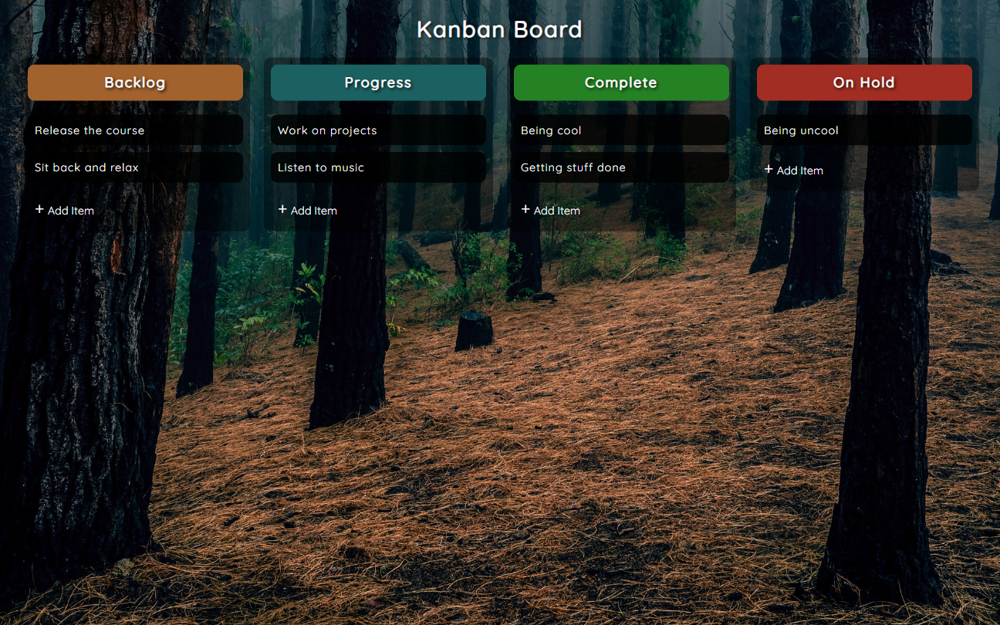

# Drag and Drop | ZTM JS Web Projects Course

**Project 16/20**

**In Process**

---

## 📚 Table of Contents

- [🔎 Overview](#-overview)
  - [📸 Screenshot](#-screenshot)
  - [🔗 Links](#-links)
  - [📌 Features](#-features)
- [🧠 My process](#-my-process)
  - [🛠️ Built with](#️-built-with)
  - [🎓 What I learned](#-what-i-learned)
  - [🔙 Previous Project](#-previous-project)
  - [🔜 Next Project](#-next-project)
  - [🗃️ Useful resources](#️-useful-resources)
- [👤 Author](#-author)
  - [🌐 Connect with Me](#-connect-with-me)
  - [💻 Coding Profiles](#-coding-profiles)

---

## 🔎 Overview

### 📸 Screenshot

### 🔗 Links

  - [🔴 Live Demo](https://dalascript.github.io/drag-and-drop/)
  - [🗂️ GitHub Repository](https://github.com/DalaScript/drag-and-drop)

### 📌 Features

  **In Process**

---

## 🧠 My Process

### 🛠️ Built with

  **In Process**

### 🎓 What I Learned

  **In Process**

  > 🚀 For me, this project was more about **practice** and gaining additional **experience**,  
  > rather than learning something entirely new.  
  >  
  > 👨‍💻 Since I’m not a beginner and already familiar with these technologies,  
  > I approached it with confidence — and still, I truly **enjoyed working on it**.  
  >  
  > 🎯 Overall, I consider this a very **valuable and enjoyable experience**.

### 🔙 Previous Project

  - Math Sprint Game | *[Project 15/20]* → [View Repository](https://github.com/DalaScript/math-sprint-game)

### 🔜 Next Project

  - Calculator | *[Project 17/20]* → [View Repository](https://github.com/DalaScript/calculator)

### 🗃️ Useful resources

  - 
  - 
  - 

---

## 👤 Author

### 🌐 Connect with Me

  - [Instagram](https://www.instagram.com/DalaScript)
  - [YouTube](https://www.youtube.com/@DalaScript)

### 💻 Coding Profiles

  - [freeCodeCamp](https://www.freecodecamp.org/DalaScript)
  - [FrontendMentor](https://www.frontendmentor.io/profile/DalaScript)
  - [GitHub](https://github.com/DalaScript)

*🙌 Thanks for checking out my project! More coming soon. Stay tuned 🚀*
